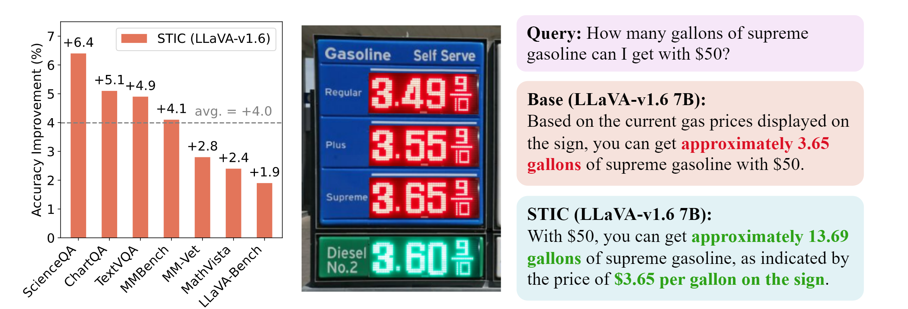
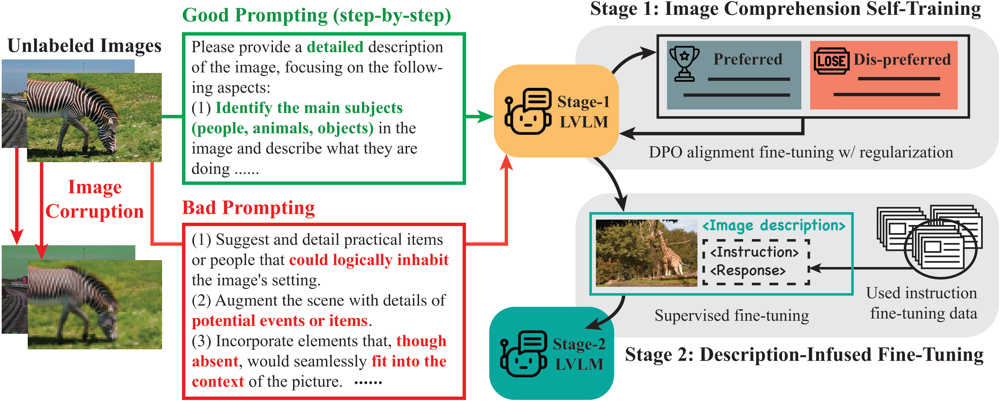
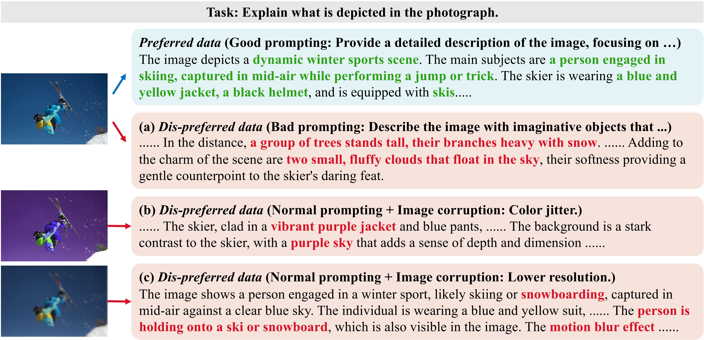

<p align="center">
     <br>
</p>
<p align="center">
    🤗 <a href="https://huggingface.co/collections/STIC-LVLM/stic-models-6658e7cdfac70f94c2a38af1" target="_blank">Models</a> | 🤗 <a href="https://huggingface.co/collections/STIC-LVLM/stic-data-6658e7f93aa5d4bb34ef140b" target="_blank">Datasets</a>
</p>

# Self-Training on Image Comprehension (STIC)

This repository contains the official code for the paper "[Enhancing Large Vision Language Models with Self-Training on Image Comprehension](https://arxiv.org/abs/)".

Authors (*Equal Contribution): [Yihe Deng](https://sites.google.com/g.ucla.edu/yihedeng/)\*, [Pan Lu](https://lupantech.github.io/)\*, [Fan Yin](https://fanyin3639.github.io/), [Ziniu Hu](https://acbull.github.io/), [Sheng Shen](https://sincerass.github.io/), [James Zou](https://www.james-zou.com/), [Kai-Wei Chang](https://web.cs.ucla.edu/~kwchang/), [Wei Wang](https://web.cs.ucla.edu/~weiwang/)

[[Project page](https://stic-lvlm.github.io/)] [[Huggingface](https://huggingface.co/STIC-LVLM)] 


**Citation**: If you find this repo useful for your research, please consider citing the paper
```
@misc{
    ...
}
```

## 🔔 News 
- **[05/30/2024]** Our paper is released on arXiv: .

## Table of Contents
- [About STIC](#-About-STIC)
- [Install](#-install)
- [Data and Models](#-Data-and-Models)
- [Instruction](#-Instruction)
- [Acknowledgement](#Acknowledgement)

## 👀 About STIC

<p align="center">
     <br>
    Left: Accuracy improvement of STIC compared to the original LLaVA-v1.6 (Mistral-7B) on seven benchmarks. Right: Response examples from the original LLaVA-v1.6 and STIC (LLaVA-v1.6). 
</p>

To tackle the data acquisition bottleneck in multi-modality, we propose **S**elf-**T**raining on **I**mage **C**omprehension (**STIC**). Inspired by the recent success of self-training methods on LLMs, our method leverages self-generated data to improve their downstream performance. Different from the text-only domain, the unique vision modality of LVLMs introduces new challenges, as LVLMs must understand the input image content before reasoning and responding to any related textual queries about the image. Therefore, the proposed STIC approach is a novel two-stage self-training method that targets both __image perception__ and __reasoning__ over images and texts. 

<p align="center">
     <br>
    Framework overview of STIC, a two-stage self-training algorithm focusing on the image comprehension capability of the LVLMs.
</p>

📝 The overall framework is summarized in the above Figure. STIC specifically emphasizes the __image comprehension self-training__ of LVLMs where the model generates its own preference dataset focused on image description. 
- The self-generated __dispreferred response__ is obtained by gathering model responses from either 
    - prompts likely to elicit inaccurate responses or 
    - corrupted images. 
- The __preferred responses__ are collected via a detailed prompt that guides the model through a step-by-step image description process. 

The Figure below shows examples of such generated responses. 
<p align="center">
     <br>
    Framework overview of STIC, a two-stage self-training algorithm focusing on the image comprehension capability of the LVLMs.
</p>

During fine-tuning, we consider a DPO loss with an additional regularized term explicitly emphasizing the preferred response. 
At stage 2, we allow the model to self-improve its reasoning ability based on its own extracted image information by reusing a small amount of existing instruction fine-tuning data and appending its self-generated image descriptions to the prompts. We refer to this second stage as __description-infused fine-tuning__. 

Notably, STIC does not require pre-labeled information of the images.

## 🛠️ Install
The following instructions provide the setup of environment on Linux. 
1. Create a virtual environment with Conda and activate.
```Shell
conda create -n stic python=3.10 -y
conda activate stic
```

2. Install packages
```Shell
pip install --upgrade pip  
pip install -e .
pip install -e ".[train]"
pip install flash-attn --no-build-isolation
pip install trl
```

3. Modify the TRL library adjust DPO for LVLMs. Replace `dpo_trainer.py` with `stic/dpo_trainer. py`. The file can be found at the following directory, where `username` should be replaced according the user's case. 
```Shell
rm /home/username/miniconda3/envs/stic/lib/python3.10/site-packages/trl/trainer/dpo_trainer.py 
cp ./stic/dpo_trainer.py /home/username/miniconda3/envs/stic/lib/python3.10/site-packages/trl/trainer/
```

4. (For stage 1 fine-tuning) Download unlabeled image data for stage 1 to your desired directory. 
```Shell
wget http://images.cocodataset.org/zips/train2014.zip 
unzip train2014.zip
```

5. (For stage 2 fine-tuning) Download the image data for stage 2 to your desired directory and organize the data as follows.
```Shell
wget http://images.cocodataset.org/zips/train2017.zip 
wget https://dl.fbaipublicfiles.com/textvqa/images/train_val_images.zip
wget https://cs.stanford.edu/people/rak248/VG_100K_2/images.zip
wget https://cs.stanford.edu/people/rak248/VG_100K_2/images2.zip
```

```
├── coco
│   └── train2017
├── textvqa
│   └── train_images
└── vg
    ├── VG_100K
    └── VG_100K_2
```

Download the 5k instruction fine-tuning data [here](https://drive.google.com/file/d/1VNT-p0qIshIESwCT3DjmHtsiYfH2VvR1/view?usp=sharing) and put it in `./data`.

## 🤖 Data and Models
We provide both the self-constructed preference data and the description-infused instruction data on HuggingFace. 

| Datasets                    |                           Download                           |
| :----------------------- | :----------------------------------------------------------: |
| Stage 1. Self-Constructed Preference Data | 🤗 [HuggingFace](https://huggingface.co/datasets/STIC-LVLM/stic-coco-preference-6k) |
| Stage 2. Description-Infused Instruction Data | 🤗 [HuggingFace](https://huggingface.co/datasets/STIC-LVLM/stic-llava-instruct-desc-5k) |


| Models (LoRA)                    |                           Download                           |
| :----------------------- | :----------------------------------------------------------: |
| Stage 1. Image Comprhension Self-Training | 🤗 [HuggingFace](https://huggingface.co/STIC-LVLM/llava-v1.6-mistral-7b-STIC-stage1) |
| Stage 2. Description-infused Fine-tuning| 🤗 [HuggingFace](https://huggingface.co/STIC-LVLM/llava-v1.6-mistral-7b-STIC) |


## 🔮 Instruction 
__Note__: Skip to step 2 if using our provided preference data on Huggingface. Skip to step 4 if using our provided model checkpoint for stage 1 and description-infused data on Huggingface. 
### Step 1. Self-construct preference data. 
```
python stic/generate_pref.py [options]
```
Options
- `--model-path`: path to the target LVLM model for training (local or huggingface)
    - default: `liuhaotian/llava-v1.6-mistral-7b`
- `--image-dir`: local directory to the unlabeled images  
    - example: `/data/username/MSCOCO/train2014`
- `--save-dir`: local directory/filename that will save the self-constructed preference data
    - default: `pref_data_mscoco.jsonl` will save the current directory

__Example script__: 
```Shell
CUDA_VISIBLE_DEVICES=0 bash scripts/generate_pref.sh
```

**Note**: parallelize the generation tasks on multiple gpus for faster generation. 

#### Step 1.1. Convert the output jsonl file to a json file. 
```
python stic/convert_jsonl_to_json.py --input pref_data_mscoco.jsonl 
```
or directly download the json file from [huggingface](https://huggingface.co/datasets/STIC-LVLM/stic-coco-preference-6k).

### Step 2. Self-training with regularized DPO. 
```Shell
bash scripts/dpo_finetune.sh
``` 
Options (change the necessary arguments in the shell script)
- `--data_path`: path to the input preference data (local or huggingface)
    - example: `pref_data_mscoco.json` 
- `--image_folder`: local directory to the unlabeled images 
    - example: `/data/username/MSCOCO/train2014`
- `--output_dir`: the directory to hold the lora weights after fine-tuning
    - example: `/data/username/checkpoints/llava_stic_stage1` 

Ensure the global batch size (number_of_devices * batch_size * gradient_accumulation_steps) is equal to our setting of 8. 

### Step 3. Description-infused Instruction Fine-tuning

#### Step 3.1 Description Generation 
```
python stic/generate_des_stage2.py [options]
```
Options
- `--model-path`: path to the target LVLM model for training (local or huggingface)
    - default: `liuhaotian/llava-v1.6-mistral-7b`
- `--adapter-path`: path to the LoRA weights after stage 1 (local or huggingface)
    - example `checkpoints/llava_coco_test`
- `--image-dir`: local directory to the images for instruction fine-tuning  
    - example: `/data/username/image_data`
- `--save-dir`: local directory/filename that will save the self-constructed preference data
    - default: `image_description.jsonl` will save the current directory

__Example script__: 
```Shell
CUDA_VISIBLE_DEVICES=0 bash scripts/generate_des_stage2.sh
```
Parellelize the task across multiple gpus to speed up the process. 
Lastly, combine the description with the instruction fine-tuning data. 
```Shell
python stic/add_des_to_data.py 
```


#### Step 3.2 Fine-tuning
```Shell
bash scripts/finetune_lora.sh
```
__Note__: change the argument for `--load_peft` to change the LoRA weight that stage 2 will start from (for example, `--load_peft STIC-LVLM/llava-v1.6-mistral-7b-STIC-stage1`). 

### Step 4. Evaluation (Please find more details for evaluation in [Evaluation](docs/Evaluation.md).) 
(We note that, our evaluation scripts follow the ones released for LLaVA-1.5, as the new evaluation scripts for LLaVA-1.6 were not released at the time of this work. This may result in some evaluation differences from the official reported values of LLaVA-1.6, as similar in this [issue](https://github.com/haotian-liu/LLaVA/issues/1326). Nevertheless, we maintain the same evaluation scripts for with/without STIC to ensure fair comparison.)

Take MMBench for example. (`pip install openpyxl` before evaluating with MMBench.)

__Option 1__. Evaluating the model performance __without__ DaR (Describe and Respond)
```Shell
python llava/eval/model_vqa_mmbench.py [options]
```
- `--load-peft`: path to the lora weights fine-tuned by SITC (local or huggingface)
    - default: `None` will evaluate the original LVLM model from `--model-path`. 
    - __example__: `ydeng9/llava-v1.6-mistral-7b-STIC` to use the provided LoRA weights. 
- `--model-path`: path to the target LVLM model for training (local or huggingface)
    - default: `liuhaotian/llava-v1.6-mistral-7b`
- `--answers-file`: local directory to the save the answers 
    - example: `/data/username/MSCOCO/train2014`

__Option 2. Evaluating the model performance with DaR (Describe and Respond)__
```Shell
python llava/eval/model_vqa_mmbench_dar.py [options]
```
Arguments are the same as `model_vqa_mmbench.py`.

__Example script__: 
```Shell
CUDA_VISIBLE_DEVICES=0 bash scripts/eval/mmbench_dar.sh
```

## Acknowledgement
This repo is built upon [LLaVA](https://github.com/haotian-liu/LLaVA) and [POVID](https://github.com/YiyangZhou/POVID). We thank all the authors for their great work. 
